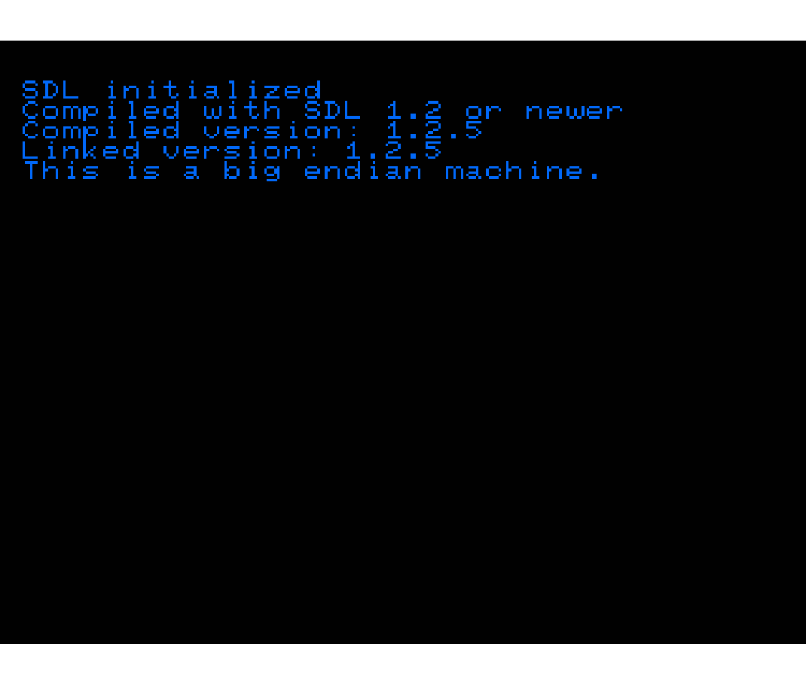
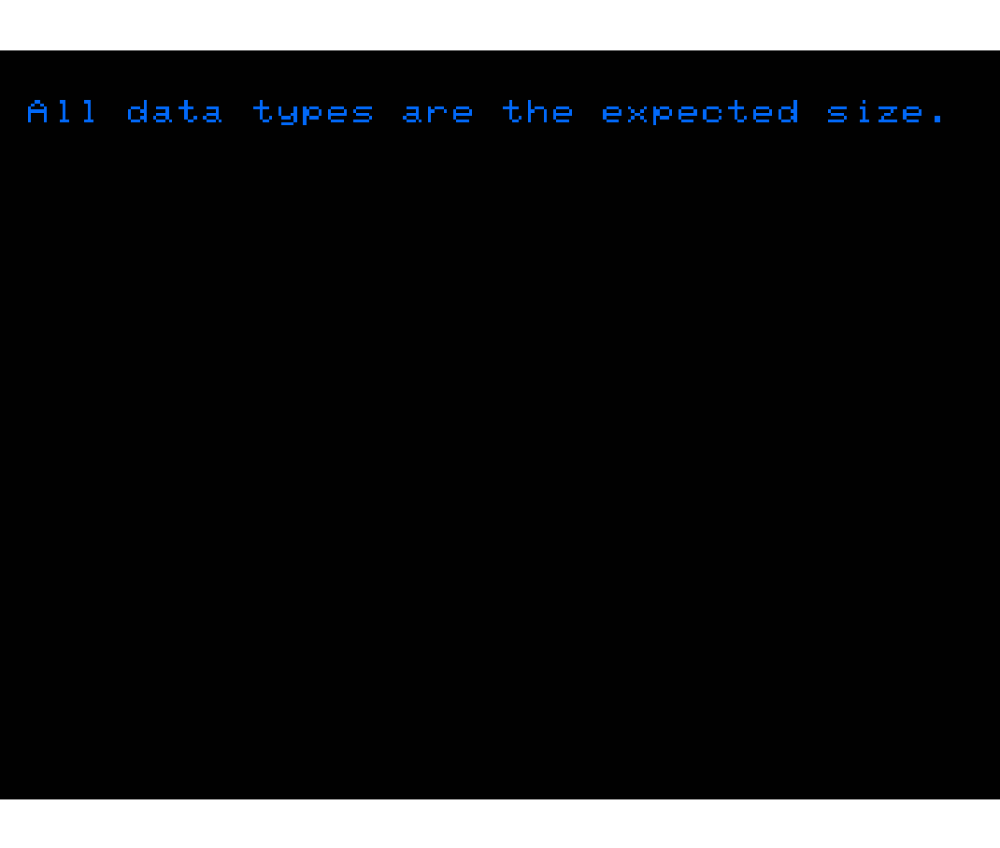
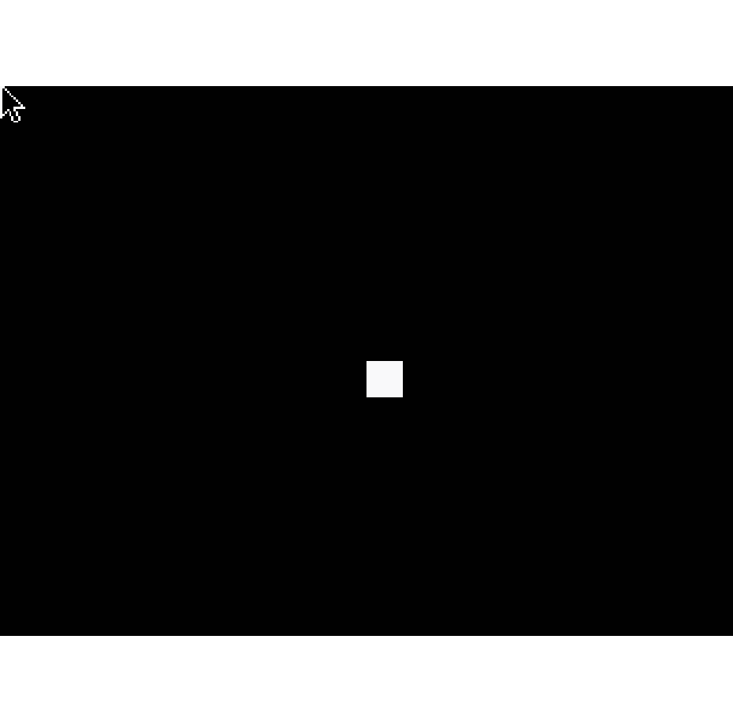

These are test programs for the SDL library:

  helloworld  Check init

 Check the version and dynamic loading and endianness

	Check to see if the data types are the correct size

	testhread	Hacked up test of multi-threading

	testlock	Hacked up test of multi-threading and locking

	testerror	Tests multi-threaded error handling

	testsem		Tests SDL's semaphore implementation

	testtimer	Test the timer facilities

	loopwave	Audio test -- loop playing a WAV file

	testcdrom	Sample audio CD control program

	testkeys	List the available keyboard keys

	testvidinfo	Show the pixel format of the display

	checkkeys	Watch the key events to check the keyboard

	testwin		Display a BMP image at various depths

	graywin		Display a gray gradient and center mouse on spacebar

	testsprite	Example of fast sprite movement on the screen

	testbitmap	Test displaying 1-bit bitmaps

	testalpha	Display an alpha faded icon -- paint with mouse

	testwm		Test window manager -- title, icon, events

	threadwin	Test multi-threaded event handling

	testgl		A very simple example of using OpenGL with SDL

	List joysticks and watch joystick events

# How to Build

  rm -rf * && cmake -DCMAKE_BUILD_TYPE=Debug \
        -DCMAKE_MODULE_PATH=/saturn/SDL_Saturn/cmake \
        -DSDL_Saturn_LIBRARY=/saturn/SDL/lib \
        -DSDL_Saturn_INCLUDE_DIR=/saturn/SDL/include \
        -DCMAKE_TOOLCHAIN_FILE=$SATURN_CMAKE/sega_saturn.cmake \
        -DCMAKE_INSTALL_PREFIX=/saturn/SDL/tests .. && make && make install
